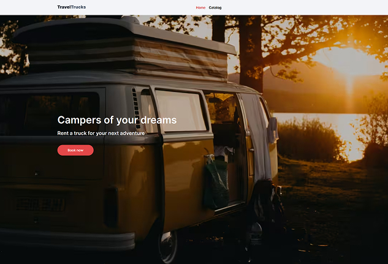
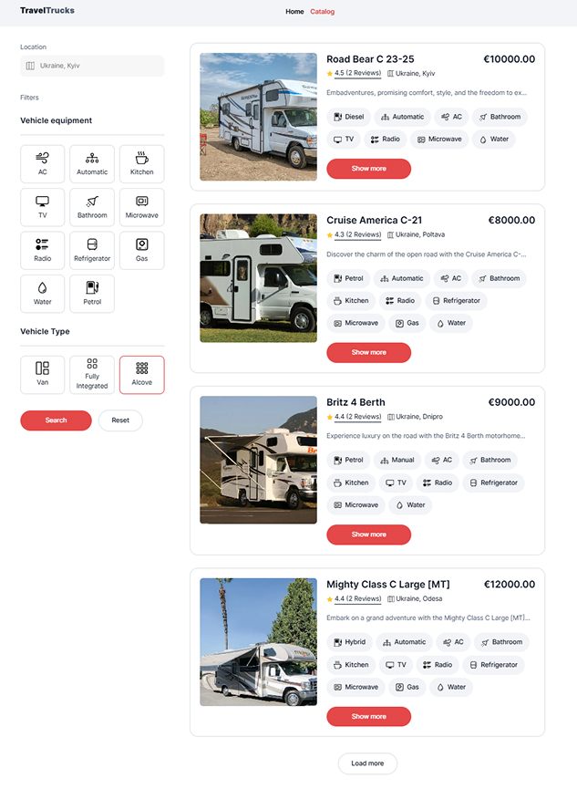
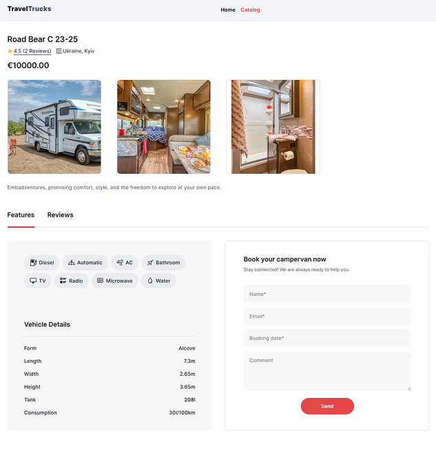

# Campers Frontend Project

## 🚐 Project Overview

The **Campers Frontend Project** is a modern, responsive web application for discovering and booking campers. Designed for a camper rental business, it offers users an intuitive interface to explore, filter, and favorite their perfect mobile home on wheels.

Whether you're planning a weekend getaway or a cross-country adventure, this app helps users make informed decisions with ease.

---

## ✨ Features

- **🏠 Home Page**: Attractive landing page with clear navigation to the catalog.
- **📋 Camper Catalog**: Displays a dynamic list of available campers with:
  - Filtering by location, vehicle type, and amenities.
  - Load more campers with button.
  - Add/remove favorites — persists across sessions (in progress).
- **🧭 Camper Details Page**:
  - Complete camper specifications
  - Photo gallery
  - User reviews and 5-star rating display
  - Integrated booking form
- **📁 Persistent State**: User preferences and favorites are saved even after a refresh.

---

## 🛠️ Technologies Used

- **Framework**: [React](https://reactjs.org/)
- **Build Tool**: [Vite](https://vitejs.dev/)
- **Routing**: [React Router](https://reactrouter.com/)
- **State Management**: [Redux Toolkit](https://redux-toolkit.js.org/)
- **API Communication**: [Axios](https://axios-http.com/)
- **Styling**: CSS Modules
- **Mock API**: [MockAPI - Campers](https://66b1f8e71ca8ad33d4f5f63e.mockapi.io/campers)
- **Deployment**: [Vercel](https://vercel.com/)

---

## 🚀 Getting Started

Follow these instructions to run the project locally.

### ✅ Prerequisites

- **Node.js** v16 or higher
- **npm** v7 or higher
- **Git** (latest version)

Check your versions:

```bash
node -v
npm -v
git --version
```

---

### 📦 Installation Steps

1. **Clone the Repository**

```bash
git clone https://github.com/Sopizhenko/campersrental
cd campers
```

2. **Install Dependencies**

```bash
npm install
```

3. **Run the Development Server**

```bash
npm run dev
```

Open your browser at [http://localhost:5173](http://localhost:5173) to see the app in action.


## 🌐 Deployment

The app is ready for deployment and can be easily hosted on platforms like **Vercel**, **Netlify**, or **GitHub Pages**.

To deploy with Vercel:

1. Push your project to GitHub
2. Go to [Vercel](https://vercel.com/)
3. Import your GitHub repository
4. Follow the deployment steps — no extra config required if using `vite`

---


## 📸 Screenshots

### 🏠 Home Page



### 📋 Camper Catalog



### 🧭 Camper Details



